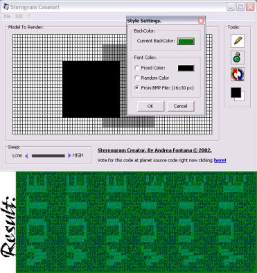



## Ascii Art & Stereogram \(do you remember 'Magic Eye'?\) FUSION\! Watch the screenshot\! \*\*UPDATED\*\*

### Description

Have you ever seen Stereograms? ("Magic Eye"?).

Have you ever seen Ascii Art? This is a FUSION!

You can draw your simple model and it create a

stereogram. Undo - Redo function include. Code

commented! If you can't see stereogram go here:

http://www.vision3d.com/3views.html !!!

UPDATE:

I've added the style window to customize your stereograms. You can color it also using a tile picture. (I also make the window resizable!)
 
### More Info
 

             |
---                |---
**Submitted On**   |2002-09-03 15:37:04
**By**             |[A\. Fontana](https://github.com/Planet-Source-Code/PSCIndex/blob/master/ByAuthor/a-fontana.md)
**Level**          |Intermediate
**User Rating**    |4.9 (230 globes from 47 users)
**Compatibility**  |VB 6\.0
**Category**       |[Complete Applications](https://github.com/Planet-Source-Code/PSCIndex/blob/master/ByCategory/complete-applications__1-27.md)
**World**          |[Visual Basic](https://github.com/Planet-Source-Code/PSCIndex/blob/master/ByWorld/visual-basic.md)
**Archive File**   |[Ascii\_Art\_126144932002\.zip](https://github.com/Planet-Source-Code/a-fontana-ascii-art-stereogram-do-you-remember-magic-eye-fusion-watch-the-screenshot-updat__1-38555/archive/master.zip)

